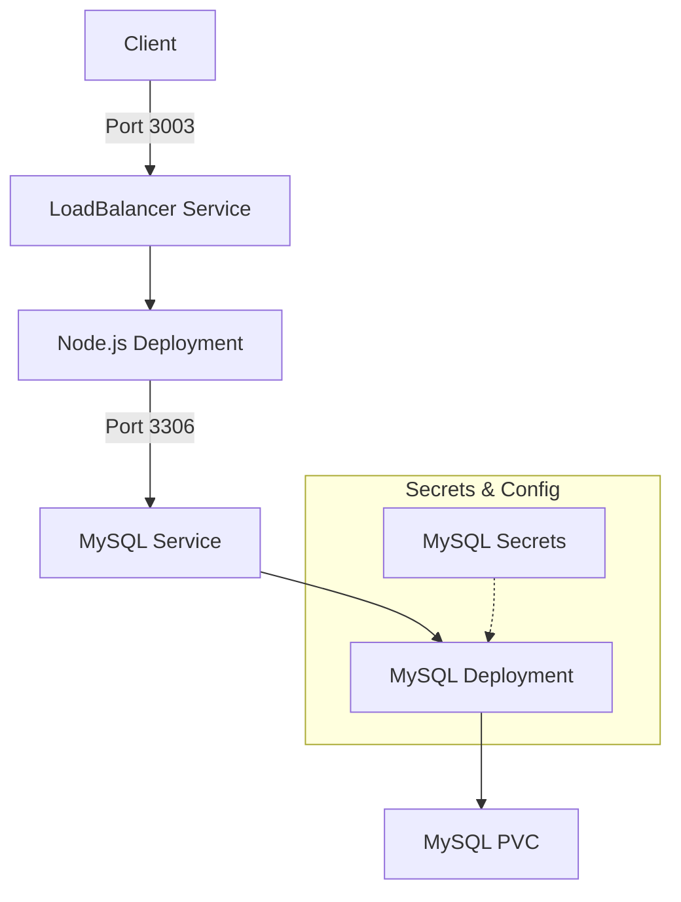

# Rapport - Projet Docker+K8s

Membres du groupe: 
- Franklin KANA NGUEDIA
- Donia SARSAR
- Mehdi SEBAI
## 1. Introduction

## 1.1 Contexte du Projet

Dans le cadre de l'évolution des architectures modernes vers des solutions conteneurisées, ce projet vise à mettre en place une architecture complète utilisant Docker et Kubernetes. Cette approche permet d'assurer une meilleure portabilité, scalabilité et maintenabilité de nos applications.

## 1.2 Objectifs du Projet

- Mettre en place une architecture microservices complète
- Déployer une base de données Mysql dans un environnement conteneurisé
- Développer et déployer une application web Node.js
- Assurer la communication sécurisée entre les différents services
- Exposer l'application de manière sécurisée via Kubernetes

## 1.3 Choix Technologiques

### Base de Données

- MYSQL 8.0
    - Choisi pour sa robustesse et ses fonctionnalités avancées
    - Support natif des JSON et des transactions complexes
    - Excellente intégration avec Kubernetes

### Application Web

- Node.js 18 LTS avec Express.js
    - Performance optimale pour les applications web
    - Large écosystème de packages
    - Facilité d'intégration avec MYSQL a l'aide de la librairie mysql nodejs

### Conteneurisation et Orchestration

- Docker Desktop 24.0
- Minikube 
- Kubernetes 1.26
- kubectl 1.26

### **a. Docker Desktop 

Docker Desktop est une application permettant de gérer des conteneurs Docker sur un environnement local, incluant un moteur Docker, une interface utilisateur et des outils de développement.

- **Usage principal** :
    - Créer, exécuter, et gérer des conteneurs localement.
    - Intégration avec des outils comme Kubernetes pour tester des déploiements.
    - Simplifie la gestion des images Docker.
- **Avantages** : Interface intuitive, idéal pour les développeurs débutants et avancés.

---

### **b. Minikube**

Minikube est un outil qui permet de configurer un cluster Kubernetes sur une machine locale, idéale pour les tests et le développement.

- **Usage principal** :
    - Déployer un environnement Kubernetes léger sur un ordinateur personnel.
    - Tester des configurations Kubernetes avant de les déployer en production.
- **Caractéristiques** :
    - Fonctionne avec des hyperviseurs comme VirtualBox, Hyper-V ou Docker.
    - Supporte différents add-ons pour simuler des environnements plus proches de la production (ingress, metrics-server, etc.).

---

### **c. Kubernetes 1.26**

Kubernetes est une plateforme d'orchestration de conteneurs utilisée pour automatiser le déploiement, la gestion et la mise à l’échelle des applications.

- **Usage principal** :
    - Orchestration de conteneurs dans des clusters.
    - Fournir des services comme la mise à l’échelle automatique, l’équilibrage de charge, et le déploiement progressif.
- **Idéal pour** : Les déploiements complexes, distribués, et de grande échelle.


### **d. kubectl 1.26**

Kubectl est la ligne de commande officielle de Kubernetes utilisée pour interagir avec les clusters Kubernetes.

- **Usage principal** :
    - Créer, gérer, et supprimer des ressources Kubernetes comme des pods, services, et déploiements.
    - Observer l'état des clusters et résoudre les problèmes.
- **Commandes courantes** :
    - `kubectl apply -f deployment.yaml` : Applique un fichier de configuration.
    - `kubectl get pods` : Affiche les pods actifs dans le cluster.
    
## 2. Architecture Déploiement


![[ks_docker.drawio.png]]
## 2.1 Vue d'Ensemble


## 2.2 Composants Principaux

### Application Node.js (Frontend/Backend)

- Image Docker: 23723/todoapp:1.0
- Port exposé: 3003
- Déployé via Kubernetes Deployment
- Exposé via LoadBalancer Service
- 1 replica pour assurer le service

### Base de Données MySQL

- Image MySQL 8.0
- Port standard 3306
- Stockage persistant via PVC de 5Gi
- Accès sécurisé via Secrets Kubernetes
- Service de type ClusterIP pour accès interne

## 2.3 Communication Inter-Services

- Frontend/Backend → MySQL : TCP 3306
- Client externe → Application : Port 3003
- Communication interne via DNS Kubernetes (mysql-service)

# 3. Infrastructure Docker

## 3.1 Images Utilisées

### Application Node.js
```dockerfile
FROM node:18-alpine

WORKDIR /app

COPY package*.json ./
RUN npm install

COPY . .

EXPOSE 3003

CMD ["npm", "start"]
```

### Base de Données

- Utilisation de l'image officielle `mysql:8.0`
- Configuration via variables d'environnement
- Persistence des données via volume

## 3.2 Variables d'Environnement

### MySQL
```plaintext
MYSQL_ROOT_PASSWORD=rootpassword
MYSQL_DATABASE=mydatabase
MYSQL_USER=user
MYSQL_PASSWORD=password
```

# 4. Orchestration Kubernetes

## 4.1 Application Node.js

```yaml
apiVersion: apps/v1
kind: Deployment
metadata:
  name: clientapp-deployment
spec:
  replicas: 1
  selector:
    matchLabels:
      app: nodejs
  template:
    metadata:
      labels:
        app: nodejs
    spec:
      containers:
      - name: nodejs
        image: 23723/todoapp:1.0
        ports:
        - containerPort: 3003

---
apiVersion: v1
kind: Service
metadata:
  name: nodejs-loadbalancer
spec:
  type: LoadBalancer
  ports:
    - port: 3003
      targetPort: 3003
  selector:
    app: nodejs
```

## 4.2 Base de Données MySQL

### Secrets
```yaml
apiVersion: v1
kind: Secret
metadata:
  name: mysql-secret
type: Opaque
data:
  mysql-root-password: cm9vdHBhc3N3b3Jk
  mysql-database: bXlkYXRhYmFzZQ==
  mysql-user: dXNlcg==
  mysql-password: cGFzc3dvcmQ=
```

### Stockage Persistant
```yaml
apiVersion: v1
kind: PersistentVolumeClaim
metadata:
  name: mysql-pvc
spec:
  accessModes:
    - ReadWriteOnce
  resources:
    requests:
      storage: 5Gi
```

### Déploiement MySQL
```yaml
apiVersion: apps/v1
kind: Deployment
metadata:
  name: mysql-deployment
spec:
  replicas: 1
  selector:
    matchLabels:
      app: mysql
  template:
    metadata:
      labels:
        app: mysql
    spec:
      containers:
      - name: mysql
        image: mysql:8.0
        env:
        - name: MYSQL_ROOT_PASSWORD
          valueFrom:
            secretKeyRef:
              name: mysql-secret
              key: mysql-root-password
        # ... autres variables d'environnement
        volumeMounts:
        - name: mysql-storage
          mountPath: /var/lib/mysql
      volumes:
      - name: mysql-storage
        persistentVolumeClaim:
          claimName: mysql-pvc
```

### Service MySQL
```yaml
apiVersion: v1
kind: Service
metadata:
  name: mysql-service
spec:
  selector:
    app: mysql
  ports:
    - protocol: TCP
      port: 3306
      targetPort: 3306
  type: ClusterIP
```

Pour comprendre les services  voici un tableau comparatif des différents types de **services Kubernetes** et leurs caractéristiques :

| **Type de Service** | **Usage Principal**                                                                    | **Visibilité**                       | **Cas d'Utilisation**                                                                                     | **Particularités**                                                                    |
| ------------------- | -------------------------------------------------------------------------------------- | ------------------------------------ | --------------------------------------------------------------------------------------------------------- | ------------------------------------------------------------------------------------- |
| **ClusterIP**       | Par défaut, expose le service uniquement au sein du cluster Kubernetes.                | Interne au cluster                   | Communication entre pods ou entre services dans le même cluster.                                          | - Assignation d'une IP interne. - Non accessible depuis l'extérieur du cluster.       |
| **NodePort**        | Expose le service sur une plage de ports fixe (30000-32767) de chaque nœud du cluster. | Externe (au niveau des nœuds)        | Accès direct à l'application pour des tests ou une petite application sans équilibrage de charge externe. | - Lié à un port spécifique. - Port limité à la plage 30000-32767.                     |
| **LoadBalancer**    | Expose le service via un équilibrage de charge (Load Balancer) fourni par le cloud.    | Externe (au niveau du Load Balancer) | Exposer une application au public via un point d'accès unique, avec équilibrage de charge automatique.    | - Nécessite un fournisseur cloud. - Automatisation de l'équilibrage de charge.        |
| **ExternalName**    | Redirige les requêtes à un nom DNS externe au cluster Kubernetes.                      | Externe (au niveau DNS)              | Accès à des services externes au cluster (ex. bases de données SaaS).                                     | - Résout uniquement les noms DNS externes. - Pas de proxy de trafic (juste un alias). |

### Notes :

- **ClusterIP** est le service par défaut si aucun type n'est spécifié.
- Les **LoadBalancers** sont souvent utilisés dans les environnements cloud (AWS, GCP, Azure) où un Load Balancer est automatiquement provisionné.

N'hésite pas si tu veux approfondir un des types ou en voir des exemples pratiques !
## 4.3 Commandes de Déploiement

```bash
# Déployer MySQL
kubectl apply -f mysql-deploy-completed.yaml

# Vérifier les secrets
kubectl get secrets

# Vérifier le PVC
kubectl get pvc

# Déployer l'application
kubectl apply -f client-deployment.yaml

# Vérifier les services
kubectl get services

# Vérifier les pods
kubectl get pods

# Logs des pods
kubectl logs <pod-name>
```


```shell
PS kubernetes_deploy> kubectl apply -f .\mysql-deploy-completed.yaml          
secret/mysql-secret created
persistentvolumeclaim/mysql-pvc created
deployment.apps/mysql-deployment created
service/mysql-service created


PS kubernetes_deploy> kubectl apply -f .\client-deployment.yaml               
deployment.apps/clientapp-deployment created
service/nodejs-loadbalancer created

```

```shell
PS Kubernetes-Docker> kubectl get secrets
NAME           TYPE     DATA   AGE
mysql-secret   Opaque   4      151m

PS Kubernetes-Docker> kubectl get pvc
NAME        STATUS   VOLUME                                     CAPACITY   ACCESS MODES   STORAGECLASS   VOLUMEATTRIBUTESCLASS   AGE
mysql-pvc   Bound    pvc-59a200d3-31ac-4e45-a382-230974602f8f   5Gi        RWO            standard       <unset>                 151m
```

```shell

PS kubernetes_deploy> kubectl get service    
NAME                  TYPE           CLUSTER-IP      EXTERNAL-IP   PORT(S)          AGE
kubernetes            ClusterIP      10.96.0.1       <none>        443/TCP          18m
mysql-service         ClusterIP      10.99.236.139   <none>        3306/TCP         15m
nodejs-loadbalancer   LoadBalancer   10.106.94.14    <pending>     3003:32332/TCP   14m

PS kubernetes_deploy> minikube service nodejs-loadbalancer --url              
http://127.0.0.1:58116
```

## 4.4 Points de Surveillance

| Composant | Commande de Vérification | Que Vérifier |
|-----------|-------------------------|--------------|
| MySQL Pod | `kubectl get pods -l app=mysql` | Status: Running |
| Node.js Pod | `kubectl get pods -l app=nodejs` | Status: Running |
| Services | `kubectl get services` | External-IP pour LoadBalancer |
| PVC | `kubectl get pvc` | Status: Bound |
| Secrets | `kubectl get secrets` | mysql-secret présent |

### **5. Difficultés rencontrées**

1. **Gestion des Secrets** : Apprendre à encoder et décoder les secrets avec Base64 était une étape critique. De plus, leur injection correcte dans les pods nécessitait une bonne compréhension des manifestes YAML.
2. **Communication inter-pods** : Configurer correctement les services Kubernetes (ClusterIP) et vérifier que l’application Node.js pouvait se connecter à MySQL via `mysql-service` a demandé plusieurs tests et ajustements.
3. **Provisionnement du stockage** : Bien que le provisionnement dynamique simplifie les choses, comprendre la relation entre PV, PVC et StorageClass a pris du temps.
4. **Débogage des pods** : Identifier pourquoi un pod échouait à démarrer ou à se connecter nécessitait l’utilisation de commandes comme `kubectl logs` et `kubectl describe`, ce qui était parfois fastidieux.
### **6.Améliorations possibles**

1. **Sécurité renforcée** :
    - Passer des Secrets de type "Opaque" à des systèmes plus sécurisés comme **Kubernetes Secrets avec encryption at rest**.
    - Ajouter des politiques RBAC (Role-Based Access Control) pour restreindre l’accès aux Secrets.
2. **Observabilité** :
    - Intégrer un système de monitoring comme **Prometheus** et **Grafana** pour surveiller les performances des pods MySQL et Node.js.
    - Ajouter des journaux centralisés avec **ELK Stack** ou **Fluentd**.
3. **Automatisation** :

    - Mettre en place un pipeline CI/CD pour automatiser le déploiement via un outil comme **GitLab CI** ou **ArgoCD**.
4. **Scalabilité** :
    - Tester l'auto-scaling horizontal pour les pods Node.js en utilisant le **Horizontal Pod Autoscaler** (HPA).
    - Explorer des bases de données adaptées à une scalabilité horizontale, comme **Vitess** pour MySQL.


## **7. Conclusion**

### **Synthèse du projet**

Ce projet avait pour objectif de déployer une base de données MySQL et une application Node.js sur Kubernetes tout en respectant les bonnes pratiques, comme la gestion des secrets et l'utilisation du stockage persistant. Grâce à Kubernetes, nous avons assuré la scalabilité, la résilience et une gestion centralisée de nos ressources.

Nous avons utilisé :

- **Secrets** pour sécuriser les informations sensibles comme les mots de passe.
- **PersistentVolumes et PersistentVolumeClaims** pour le stockage persistant des données MySQL.
- Un **Service** pour permettre la communication entre MySQL et l’application Node.js.
- Une stratégie d’injection d’environnements via Kubernetes pour rendre le système flexible et modifiable sans changer le code source.

L’intégration entre les différentes ressources Kubernetes a permis une orchestration efficace de notre architecture.
