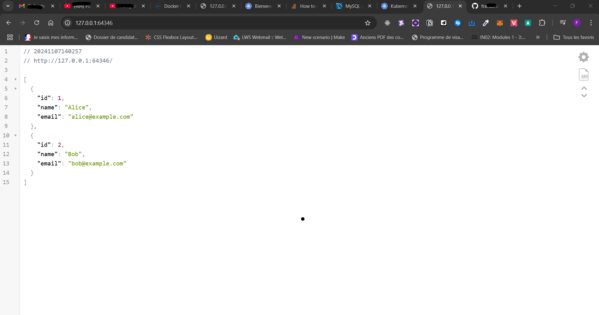

Voici une description d'un petit projet utilisant Kubernetes et Docker pour orchestrer une application simple composée d'un client Node.js et d'une base de données MySQL.

Le but est de comprendre comment fonctionne architecture sur kubernetes (pods, services, ... )

## Description du Projet

### Objectif
Le projet vise à déployer une application web basique où un client Node.js interagit avec une base de données MySQL, le tout orchestré à l'aide de Docker et Kubernetes. Cela permettra de comprendre comment conteneuriser une application et gérer son déploiement dans un environnement cloud.

### Architecture du Projet
1. **Client Node.js**:
   - Une application web qui fait des requêtes à la base de données MySQL.
   - Utilise Express.js pour créer une API REST simple.
   - Expose un endpoint pour interagir avec les données de la base.

2. **Base de données MySQL**:
   - Stocke les données nécessaires pour l'application.
   - Accessible uniquement par le service Node.js pour des raisons de sécurité.

### Conteneurisation
- **Docker**:
  - Créer un `Dockerfile` pour l'application Node.js.

### Orchestration
- **Kubernetes**:
  - Déployer notre BD MYQL sur un pods.
  - Déployer application web sur un pods.
  - Créer des fichiers de configuration YAML pour les déploiements et les services.
  - Configurer un **Service** pour exposer le client Node.js et permettre l'accès à la base de données.

### Étapes du Projet

1. **Conteneurisation avec Docker**:
   - Écrire le `Dockerfile` pour l'application Node.js.

2. **Déploiement sur Kubernetes**:
   - Configurer les fichiers `mysql-deployment.yaml` et `client-deploiement.yaml` pour Node.js et MySQL.
   - Déployer les ressources sur le cluster Kubernetes à l'aide de `kubectl`.

3. **Tests et Validation**:
   - Tester l'application pour s'assurer que le client peut se connecter à la base de données.

### Technologies Utilisées
- **Node.js**: Pour le développement du serveur.
- **Express.js**: Pour la création de l'API.
- **MySQL**: Comme base de données relationnelle.
- **Docker**: Pour la conteneurisation.
- **Kubernetes**: Pour l'orchestration et la gestion des conteneurs.

### Conclusion

Ce projet permettra de se familiariser avec les concepts fondamentaux de Docker et Kubernetes, tout en développant une application web simple. Il servira également de base pour des projets plus complexes impliquant des architectures microservices.


### Explications :

- **Docker** est principalement utilisé pour la **containerisation** : construire des images, créer des conteneurs, et gérer localement ou via un registre (Docker Hub, etc.).
- **Kubernetes** exploite ces conteneurs et offre des capacités avancées d'**orchestration**, de **scalabilité**, de **disponibilité**, et de **gestion du réseau** dans un environnement distribué.

### NOTES IMPORTANTES:

Ce fichier n'a pas pour but d'être utilisé en production et présente certaines failles, notamment en ce qui concerne la gestion des clés de connexion. De plus, nous n'utilisons pas de volumes persistants (PV et PVC) pour le stockage. Ce projet ne prend pas en compte les problématiques de haute disponibilité ni de montée en charge. Nous aborderons ces aspects dans les jours à venir.

#### Déployer une image mysql sur kubernetes (en utilisant le YAML)

1- déployer mysql sur un pods kubernetes 
```
kubernetes_deploy> kubectl apply -f .\mysql-deployment.yaml

deployment.apps/mysql-deployment created
service/mysql-service created
```

2- vérifier le déploiement 
```
kubernetes_deploy> kubectl get pods
NAME                                    READY   STATUS    RESTARTS   AGE
mysql-deployment-7bb95c6bb4-4mqqf       1/1     Running   0          20m
```


#### déployer notre client nodejs 

NB: Dans cette partie nous devons d'abord créer notre propre image docker et le push sur docker hub contrairement avec mysql qui est fourni par docker hub mysql

- Déployer notre image (application nodejs) sur docker hub	
	-créer un fichier Dockerfile
	-Build image docker en local 
	-Push l'image sur notre docker hub
	
- Déployer image de notre client sur kubernetes 
```
kubernetes_deploy> kubectl apply -f .\client-deployment.yaml

deployment.apps/clientapp-deployment created
service/nodejs-loadbalancer created
```

 2. verifier le deploiement 
 ```
kubernetes_deploy> kubectl get pods
NAME                                    READY   STATUS    RESTARTS   AGE
clientapp-deployment-684c6f487b-rlzg2   1/1     Running   0          117s
mysql-deployment-7bb95c6bb4-4mqqf       1/1     Running   0          20m
```


## Ajouter des utilisateurs dans notre  base de données MYSQL 

Notre application affiche tous les utilisateurs présents dans notre BD sous le format JSON 

1- Retrouver le nom du pods associer a notre déploiement mysql
```
\app_kurbenetes> kubectl get pods 
NAME                                    READY   STATUS    RESTARTS   AGE
clientapp-deployment-684c6f487b-rlzg2   1/1     Running   0          8m8s
mysql-deployment-7bb95c6bb4-4mqqf       1/1     Running   0          26m
```
1- Creer la base de donnees et inserer quelques utilisateurs 
- Acceder au bash de notre pods pour executer notre script sql
```
\app_kurbenetes> kubectl exec -it mysql-deployment-7bb95c6bb4-4mqqf  -- mysql -u root -p
Enter password: 
Welcome to the MySQL monitor.  Commands end with ; or \g.
Your MySQL connection id is 9
Server version: 8.0.40 MySQL Community Server - GPL

Copyright (c) 2000, 2024, Oracle and/or its affiliates.

Oracle is a registered trademark of Oracle Corporation and/or its
affiliates. Other names may be trademarks of their respective
owners.

Type 'help;' or '\h' for help. Type '\c' to clear the current input statement.

mysql> CREATE DATABASE mydatabase;
E TABLE users (ERROR 1007 (HY000): Can't create database 'mydatabase'; database exists
mysql> USE mydatabase;

  id INT AUTO_INCREMENT PRIMARY KEY,
  name VARCHAR(100) NOT NULL,
  email VARCHAR(100) NOT NULL
);

INSERT INTO users (name, email) VALUES ('Alice', 'alice@example.com'), ('Bob', 'bob@example.com');Database changed
mysql>
mysql> CREATE TABLE users (
    ->   id INT AUTO_INCREMENT PRIMARY KEY,
    ->   name VARCHAR(100) NOT NULL,
    ->   email VARCHAR(100) NOT NULL
    -> );
Query OK, 0 rows affected (0.33 sec)

mysql>
mysql> INSERT INTO users (name, email) VALUES ('Alice', 'alice@example.com'), ('Bob', 'bob@example.com');
Query OK, 2 rows affected (0.13 sec)
Records: 2  Duplicates: 0  Warnings: 0

mysql> show table;
ERROR 1064 (42000): You have an error in your SQL syntax; check the manual that corresponds to your MySQL server version for the right syntax to use near '' at line 1
mysql> show tables;
+----------------------+
| Tables_in_mydatabase |
+----------------------+
| users                |
+----------------------+
1 row in set (0.01 sec)
```

## Résultat 

1- Vérification des services :
```
\kubernetes_deploy> kubectl get services 
NAME                  TYPE           CLUSTER-IP       EXTERNAL-IP   PORT(S)          AGE
kubernetes            ClusterIP      10.96.0.1        <none>        443/TCP          22m
mysql-service         ClusterIP      10.106.112.233   <none>        3306/TCP         20m
nodejs-loadbalancer   LoadBalancer   10.111.143.98    <pending>     3003:32703/TCP   2m16s
```

2- Vérifions notre services qui permet d'exposer notre application vers extérieure
```
\kubernetes_deploy> kubectl describe  services nodejs-loadbalancer
Name:                     nodejs-loadbalancer
Namespace:                default
Labels:                   <none>
Annotations:              <none>
Selector:                 app=nodejs
Type:                     LoadBalancer
IP Family Policy:         SingleStack
IP Families:              IPv4
IP:                       10.111.143.98
IPs:                      10.111.143.98
Port:                     <unset>  3003/TCP
TargetPort:               3003/TCP
NodePort:                 <unset>  32703/TCP
Endpoints:                10.244.0.7:3003
Session Affinity:         None
External Traffic Policy:  Cluster
Events:                   <none>
```

3- Retrouver url de notre services exposer

```
\kubernetes_deploy> minikube service nodejs-loadbalancer          
|-----------|---------------------|-------------|---------------------------|
| NAMESPACE |        NAME         | TARGET PORT |            URL            |
|-----------|---------------------|-------------|---------------------------|
| default   | nodejs-loadbalancer |        3003 | http://192.168.49.2:32703 |
|-----------|---------------------|-------------|---------------------------|
🏃  Starting tunnel for service nodejs-loadbalancer.
|-----------|---------------------|-------------|------------------------|
| NAMESPACE |        NAME         | TARGET PORT |          URL           |
|-----------|---------------------|-------------|------------------------|
| default   | nodejs-loadbalancer |             | http://127.0.0.1:64346 |
|-----------|---------------------|-------------|------------------------|
🎉  Opening service default/nodejs-loadbalancer in default browser...
❗  Because you are using a Docker driver on windows, the terminal needs to be open to run it.
```
